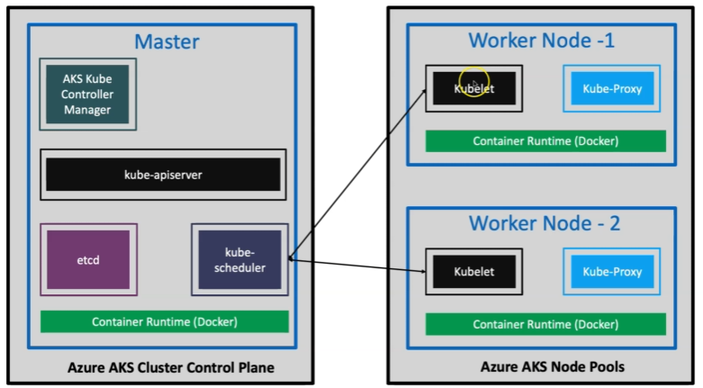
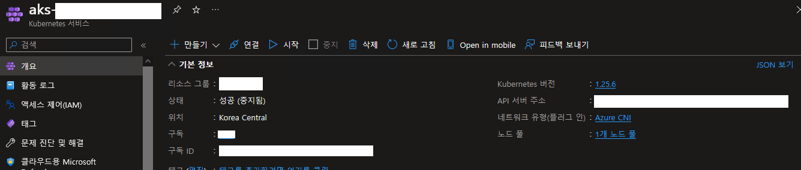
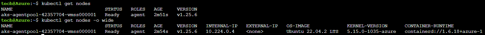
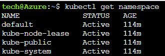

# Architecture

AWS 매니저 노드 그룹 = Azure 노드 풀

Master는 AKS가 자동으로 관리해준다





## AKS Cluster Control Plane

### etcd

백업 저장소로 사용되는 키값 저장소


### kube-scheduler

여러 노드에 걸쳐 컨테이너 배포를 담당

실행할 노드를 선택


### kube-apiserver

쿠버네티스 API를 노출

master의 핵심


### kube controller manager

작업노드가 중지되면 반응(다운노드 확인)

파드가 의도한 복제(Replica) 숫자를 유지하는 지,

서비스와 파드는 적절하게 연결되어 있는지,

네임스페이스에 대한 기본계정과 토큰이 생성되어 있는지 확


## AKS Node Pools

마찬 가지로 컨테이너 런타임 기반 실행


### kubelet

kube-scheduler와 통신


### kube-proxy

네트워크 프록시


## AKS 생성

Portal -> AKS 생성

노드 크기는 DS2_v2

노드 수 : 1

인증 방법: 시스템 할당 관리 ID

네트워크 구성 : 고급

네트워크 정책: Azure




## CloudShell 설정

```
# 자격 증명 생성
az aks get-credentials --resource-group <Resource-Group-Name> --name <Cluster-Name>

# examples
az aks get-credentials --resource-group aks-rg --name testakscluster

# List Kubernetes Worker Nodes
kubectl get nodes           #노드 정보 확인
kubectl get nodes -o wide   #자세한 정보 확인
```




## 컨트롤 플레인 및 내부 탐색

```
# List Namespaces
kubectl get namespaces
kubectl get ns

# List Pods from all namespaces
kubectl get pods --all-namespaces

# List all k8s objects from Cluster Control plane
kubectl get all --all-namespaces
```




## 로컬 설정

```bash
#활성 구독 확인
az account show

#활성 구독 선택
az account set --subscription tech
```


구독이 다수인 경우 위와 같이 구독을 선택


```bash
# Install Azure CLI (MAC)
# 윈도우의 경우 다운로드 설치
brew update && brew install azure-cli

# Login to Azure
az login

# Install Azure AKS CLI
az aks install-cli

# Configure Cluster Creds (kube config)
az aks get-credentials --resource-group aks-rg1 --name aksdemo1

# List AKS Nodes
kubectl get nodes 
kubectl get nodes -o wide
```


